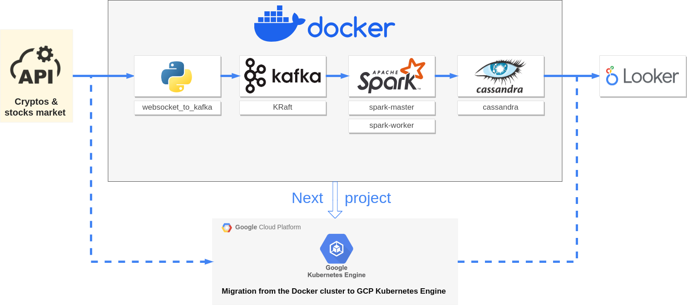

## Deploying a Docker multi-container architecture (Airflow, Kafka, Spark, and Cassandra)

I am replicating and customizing the great project from [Dogukan Ulu](https://dogukanulu.dev/) :

* [Data Engineering End-to-End Project — Spark, Kafka, Airflow, Docker, Cassandra, Python](https://medium.com/@dogukannulu/data-engineering-end-to-end-project-1-7a7be2a3671)

* Github repo : [https://github.com/dogukannulu/kafka_spark_structured_streaming](https://github.com/dogukannulu/kafka_spark_structured_streaming)

I have chosen to use some anothers and latest images available on 2023-11-06 from [Docker Hub](https://hub.docker.com/) for the following services:

<table>
<tr><th>service</th><th>image</th><th></th></tr>
<tr><td>KRaft</td><td>bitnami/kafka:3.6</td><td>Implementing KRaft mode : <a href="https://developer.confluent.io/learn/kraft/">Kafka Without ZooKeeper</a> <a href="https://hub.docker.com/r/bitnami/kafka">https://hub.docker.com/r/bitnami/kafka</a></td></tr>
<tr><td>webserver scheduler</td><td>apache/airflow:2.7.2-python3.10</td><td><a href="https://airflow.apache.org/docs/docker-stack/index.html">https://airflow.apache.org/docs/docker-stack/index.html</a></tr>
<tr><td>postgres</td><td>postgres:16</td><td><a href="https://hub.docker.com/_/postgres">https://hub.docker.com/_/postgres</a></td>
<tr><td>spark-master spark-worker</td><td>bitnami/spark:3.5.0</td><td><a href="https://hub.docker.com/r/bitnami/spark">https://hub.docker.com/r/bitnami/spark</td></tr>
<tr><td>postgresql</td><td>bitnami/postgresql:16</td><td><a href="https://hub.docker.com/r/bitnami/spark">https://hub.docker.com/r/bitnami/postgresql</td></tr>
</table>

Cassandra's driver doesn't support spark 3.5.0 yet, i'll replace it by postgresql or and/or mongoDB.

I gained extensive knowledge about Docker, dependency management while replicating this project, and i liked the CI/CD process. This newfound interest led me to opt for migrating to GCP Kubernetes Engine (see my on going project [Spark on Kubernetes repo](https://github.com/yzpt/spark_on_kubernetes/))

