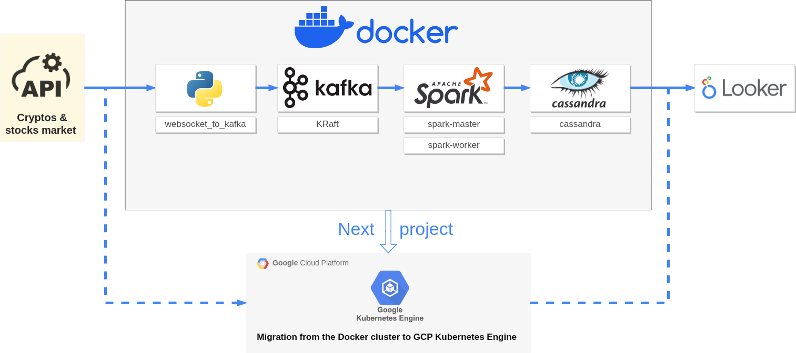

# Deploying a Docker multi-container streaming architecture (Kafka, Spark, and Cassandra)



<hr>


I have chosen these images from [Docker Hub](https://hub.docker.com/) for the following services:

<div style="display:flex; justify-content:center; width:100%">
<table>
<tr><th>service</th><th>image</th><th></th></tr>
<tr><td>kafka</td><td>bitnami/kafka:3.6</td><td>Implementing KRaft mode :<br> <a href="https://developer.confluent.io/learn/kraft/">Kafka Without ZooKeeper</a><br><br><a href="https://hub.docker.com/r/bitnami/kafka">https://hub.docker.com/r/bitnami/kafka</a></td></tr>
<tr><td>webserver<br>scheduler</td><td>apache/airflow:2.7.2-python3.10</td><td><a href="https://airflow.apache.org/docs/docker-stack/index.html">https://airflow.apache.org/docs/docker-stack/index.html</a></tr>
<tr><td>postgres</td><td>postgres:16</td><td><a href="https://hub.docker.com/_/postgres">https://hub.docker.com/_/postgres</a></td>
<tr><td>spark-master<br>spark-worker</td><td>bitnami/spark:3.4.1</td><td><a href="https://hub.docker.com/r/bitnami/spark">https://hub.docker.com/r/bitnami/spark</td></tr>
<tr><td>cassandra</td><td>cassandra:5.0</td><td><a href="https://hub.docker.com/_/cassandra/tags">https://hub.docker.com/_/cassandra/tags</td></tr>
</table>
</div>

## 1. Real-time websocket extraction container

[https://pypi.org/project/websocket_client/](https://pypi.org/project/websocket_client/)

```python
import websocket
import json
from kafka import KafkaProducer

# read api key from file
with open('keys/finnhub_api_key.txt') as f:
    api_key = f.read()
    f.close()

producer = KafkaProducer(bootstrap_servers=['kafka:9092'])
  

def on_message(ws, message):
    json_message = json.loads(message)
    trades = json_message['data']

    for trade in trades:
        kafka_data = {}
        kafka_data["symbol"] = trade['s']
        kafka_data["price"] = trade['p']
        kafka_data["volume"] = trade['v']
        kafka_data["timestamp_unix"] = trade['t']
        kafka_data["conditions"] = trade['c']
        producer.send('crypto_trades', json.dumps(kafka_data).encode('utf-8'))

def on_error(ws, error):
    print(error)

def on_close(ws):
    print("### closed ###")

def on_open(ws):
    ws.send('{"type":"subscribe","symbol":"BINANCE:BTCUSDT"}')

if __name__ == "__main__":
    websocket.enableTrace(True)
    ws = websocket.WebSocketApp("wss://ws.finnhub.io?token=" + api_key ,
                              on_message = on_message,
                              on_error = on_error,
                              on_close = on_close)
    ws.on_open = on_open
    ws.run_forever()
```


## 2. Kafka

## 3. Spark

## 4. Cassandra

## 5. Looker

