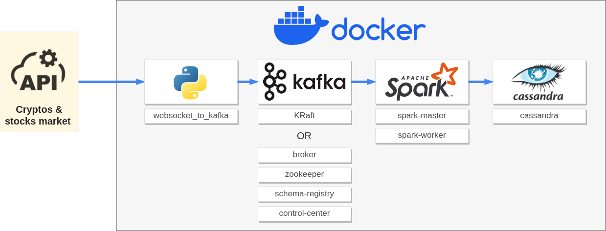
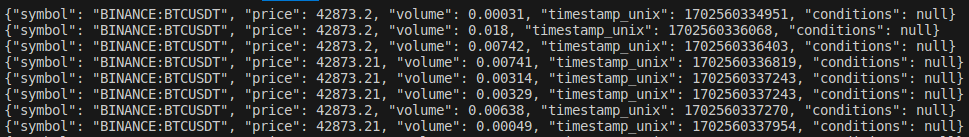
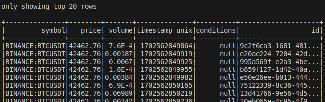
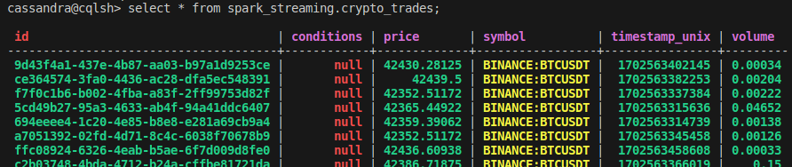

# Deploying a Docker multi-container streaming architecture (Kafka, Spark, and Cassandra)



<hr>


I have chosen these images from [Docker Hub](https://hub.docker.com/) for the following services:

<div style="display:flex; justify-content:center; width:100%">
<table>
<tr><th>service</th><th>image</th><th></th></tr>
<tr><td>kafka</td><td>bitnami/kafka:3.6</td><td>Implementing KRaft mode :<br> <a href="https://developer.confluent.io/learn/kraft/">Kafka Without ZooKeeper</a><br><br><a href="https://hub.docker.com/r/bitnami/kafka">https://hub.docker.com/r/bitnami/kafka</a></td></tr>
<tr><td>webserver<br>scheduler</td><td>apache/airflow:2.7.2-python3.10</td><td><a href="https://airflow.apache.org/docs/docker-stack/index.html">https://airflow.apache.org/docs/docker-stack/index.html</a></tr>
<tr><td>postgres</td><td>postgres:16</td><td><a href="https://hub.docker.com/_/postgres">https://hub.docker.com/_/postgres</a></td>
<tr><td>spark-master<br>spark-worker</td><td>bitnami/spark:3.4.1</td><td><a href="https://hub.docker.com/r/bitnami/spark">https://hub.docker.com/r/bitnami/spark</td></tr>
<tr><td>cassandra</td><td>cassandra:5.0</td><td><a href="https://hub.docker.com/_/cassandra/tags">https://hub.docker.com/_/cassandra/tags</td></tr>
</table>
</div>

## 1. Real-time websocket extraction container

Docker container using [websocket-client](https://pypi.org/project/websocket_client/) and [kafka-python](https://pypi.org/project/kafka-python/) to extract real-time data from [Finnhub](https://finnhub.io/).

```bash
extract/
├── keys/
│   └── finnhub_api_key.txt 
├── Dockerfile
├── requirements_extract.txt
└── main.py
```

<details>
<summary>extract/main.py</summary>

```python
import websocket
import json
from kafka import KafkaProducer, KafkaConsumer
import time


def wait_for_kafka():
    while True:
        try:
            consumer = KafkaConsumer(bootstrap_servers='kafka:9092')
            # If the above line doesn't throw an exception, Kafka is ready
            break
        except Exception:
            print("Waiting for Kafka to start...")
            time.sleep(1)
  

def on_message(ws, message):
    json_message = json.loads(message)
    trades = json_message['data']

    for trade in trades:
        kafka_data = {}
        kafka_data["symbol"] = trade['s']
        kafka_data["price"] = trade['p']
        kafka_data["volume"] = trade['v']
        kafka_data["timestamp_unix"] = trade['t']
        kafka_data["conditions"] = trade['c']
        producer.send('crypto_trades', json.dumps(kafka_data).encode('utf-8'))

def on_error(ws, error):
    print(error)

def on_close(ws):
    print("### closed ###")

def on_open(ws):
    ws.send('{"type":"subscribe","symbol":"BINANCE:BTCUSDT"}')

if __name__ == "__main__":
    try:
        with open('keys/finnhub_api_key.txt') as f:
            api_key = f.read()
            f.close()

        # displaying messages on console
        websocket.enableTrace(True)

        wait_for_kafka()

        producer = KafkaProducer(bootstrap_servers=['kafka:9092'])

        ws = websocket.WebSocketApp("wss://ws.finnhub.io?token=" + api_key ,
                                on_message = on_message,
                                on_error = on_error,
                                on_close = on_close)
        ws.on_open = on_open
        ws.run_forever()
    
    except Exception as e:
        print(e)
```
</details>

## 2. Kafka

Configuring Kraft mode via `docker-compose.yaml`:

```yaml
version: "3.8"
services:

    ...

# === kafka ===========================================================
  kafka:
    image: bitnami/kafka
    container_name: kafka
    ports:
      - 9092:9092
    environment:
      - KAFKA_ENABLE_KRAFT=yes
      - KAFKA_CFG_PROCESS_ROLES=broker,controller
      - KAFKA_CFG_CONTROLLER_LISTENER_NAMES=CONTROLLER
      - KAFKA_CFG_LISTENERS=PLAINTEXT://:9092,CONTROLLER://:2181
      - KAFKA_CFG_LISTENER_SECURITY_PROTOCOL_MAP=CONTROLLER:PLAINTEXT,PLAINTEXT:PLAINTEXT
      - KAFKA_CFG_ADVERTISED_LISTENERS=PLAINTEXT://kafka:9092
      - KAFKA_BROKER_ID=1
      - KAFKA_CFG_CONTROLLER_QUORUM_VOTERS=1@127.0.0.1:2181
      - ALLOW_PLAINTEXT_LISTENER=yes
      - KAFKA_CFG_NODE_ID=1
      - KAFKA_KRAFT_CLUSTER_ID=MkU3OEVBNTcwNTJENDM2Qk
    networks:
      - cluster
```
Start extracting data from Finnhub and sending it to Kafka:

```bash
docker compose up -d extract kafka
```
Check that the data is being sent to Kafka:

```bash
docker exec kafka kafka-console-consumer.sh --bootstrap-server localhost:9092 --topic crypto_trades --from-beginning
```


## 3. Spark

```docker-compose.yaml
version: "3.8"
services:
    
      ...

# === Spark =======
  spark-master:
    image: bitnami/spark:3.4.1
    ports:
      - "9090:8080"
      - "7077:7077"
    volumes:
      - ./spark_entrypoint.sh:/entrypoint.sh
      - ./spark_streaming.py:/opt/bitnami/pyspark_scripts/spark_streaming.py
      - ./vol_spark_checkpoint:/opt/bitnami/pyspark_scripts/checkpoint
    command: ["/bin/bash", "/entrypoint.sh"]
    networks:
      - cluster
  
  spark-worker:
    image: bitnami/spark:3.4.1
    command: bin/spark-class org.apache.spark.deploy.worker.Worker spark://spark-master:7077
    depends_on:
      - spark-master
    environment:
      SPARK_MODE: worker
      SPARK_WORKER_CORES: 2
      SPARK_WORKER_MEMORY: 1g
      SPARK_MASTER_URL: spark://spark-master:7077
    networks:
      - cluster

```

Start Spark containers and start streaming:

```bash
# start spark containers
docker compose up -d extract kafka spark-master spark-worker
docker compose down

# connect to spark-master container
docker exec -it crypto_streaming-spark-master-1 /bin/bash

# start streaming
spark-submit --master local --packages org.apache.spark:spark-sql-kafka-0-10_2.12:3.4.1,com.datastax.spark:spark-cassandra-connector_2.12:3.4.1 /opt/bitnami/pyspark_scripts/spark_streaming.py
```

Check that the data is streamed by spark by displaying the trace on the console:

spark_streaming.py

```python

    [...]

def print_to_console(df, epoch_id):
    df.show()

def start_cassandra_streaming(df):
    """
    Starts the streaming to table spark_streaming.random_names in cassandra
    """
    logging.info("Streaming is being started...")
    my_query = (df.writeStream
                  .format("org.apache.spark.sql.cassandra")
                  .outputMode("append")
                  .option("checkpointLocation", "checkpoint")
                  .options(table="crypto_trades", keyspace="spark_streaming")
                  #.foreachBatch(print_to_console) # <-- uncomment this line to print to container's console
                  # /!\ if uncommented, cassandra is not feeded /!\
                  .start())

    return my_query.awaitTermination()

    [...]

```



## 4. Cassandra

```docker-compose.yaml
version: "3.8"
services:
    
        [...]

# === Cassandra ====================================================================================================
  cassandra:
    image: cassandra:5.0
    container_name: cassandra
    hostname: cassandra
    volumes:
      - ./vol_cassandra_data:/var/lib/cassandra
    ports:
      - 9042:9042
    environment:
      - MAX_HEAP_SIZE=512M
      - HEAP_NEWSIZE=100M
      - CASSANDRA_USERNAME=cassandra
      - CASSANDRA_PASSWORD=cassandra
    networks:
      - cluster

    [...]

```

Start Cassandra container 

```bash
docker compose up -d extract kafka spark-master spark-worker cassandra
```

Creating the keyspace and table in Cassandra:

```bash
# connect to cassandra container
docker exec -it cassandra /bin/bash

# connect to cassandra
cqlsh -u cassandra -p cassandra

# create keyspace
CREATE KEYSPACE spark_streaming WITH replication = {'class':'SimpleStrategy','replication_factor':1};

# create table
CREATE TABLE spark_streaming.crypto_trades(
    id uuid primary key,
    symbol text,
    price float,
    volume float,
    timestamp_unix bigint,
    conditions text
);
```
## 5. Running pipeline

Start streaming:

```bash
docker compose down --remove-orphans
docker compose up -d

# connect to spark-master container
docker exec -it crypto_streaming-spark-master-1 /bin/bash

# start streaming
spark-submit --master local --packages org.apache.spark:spark-sql-kafka-0-10_2.12:3.4.1,com.datastax.spark:spark-cassandra-connector_2.12:3.4.1 /opt/bitnami/pyspark_scripts/spark_streaming.py
```

Check that the data is being inserted in Cassandra:

```bash
# connect to cassandra container
docker exec -it cassandra /bin/bash

# connect to cassandra
cqlsh -u cassandra -p cassandra

# check that data is being inserted in cassandra
select * from spark_streaming.crypto_trades;
```


